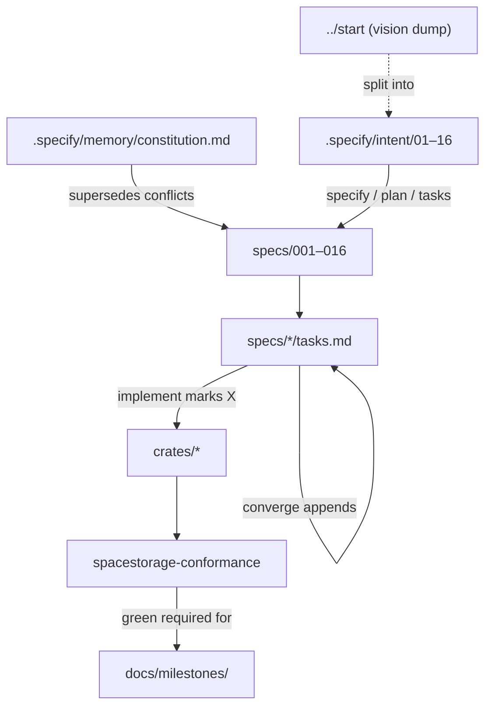
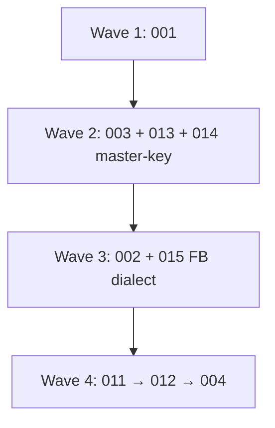
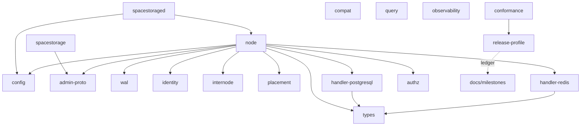
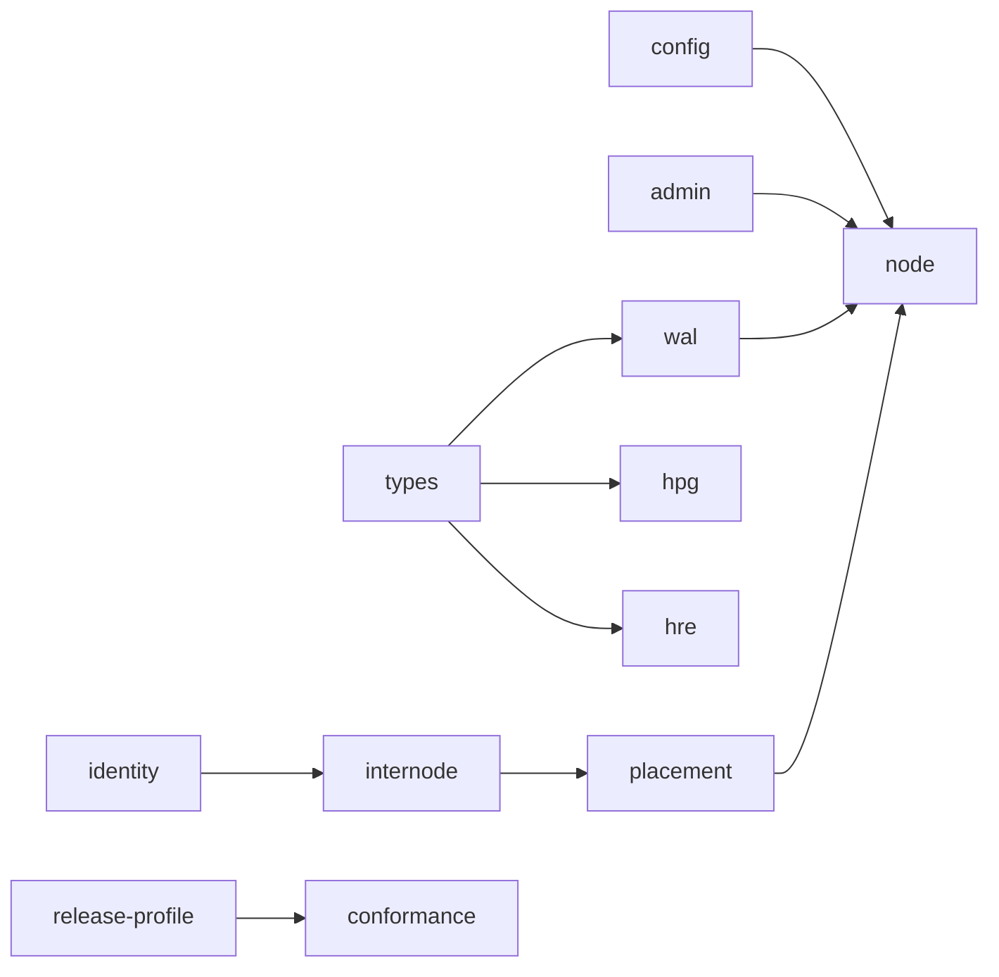

# Agent context graph — SpaceStorage server

Durable map for humans and agents working in `server/`. Machine outline: [`agent-context-graph.json`](agent-context-graph.json). Not an MCP install.

## Where truth lives

| Layer | Path | Role |
|-------|------|------|
| Constitution | `.specify/memory/constitution.md` | Non-negotiable principles |
| Intent | `.specify/intent/` | Speckit input; wins over `start` per domain |
| Specs | `specs/001`–`016` | Spec, plan, contracts, `tasks.md` |
| Milestones | `docs/milestones/` | What shipped vs deferred (`still_owed`) |
| Code | `crates/` | Implementation |
| Gate | `cargo test -p spacestorage-conformance --features first-binary` | First-binary DoD signal |

## Slice ladder → specs

Implementation slices (not specify order). First binary = slices 1–5.

```mermaid
flowchart LR
  S1["1 Runtime"] --> S2["2 Types+durability"]
  S2 --> S3["3 PostgreSQL"]
  S3 --> S4["4 Redis"]
  S4 --> S5["5 Membership+quorum"]
  S5 -.-> S6["6 Remaining handlers"]
  S6 -.-> S7["7 Raft/tenancy/authz"]
  S7 -.-> S8["8 Query beyond CRUD"]
  S8 -.-> S9["9 Observability catalog"]
  S9 -.-> S10["10 Migration/PITR"]
  S10 -.-> S11["11 UIs/ingest"]
```

| Slice | Specs | First binary |
|------:|-------|:------------:|
| 1 | `001` | yes |
| 2 | `003`, `013`, `014` (master-key) | yes |
| 3 | `002` (postgresql dialect) | yes |
| 4 | `002` (redis) + `015` K/V MUST | yes |
| 5 | `011` → `012` → `004` | yes |
| 6 | remaining `002` handlers at `015` MUST | deferred |
| 7 | `006`, `007`, `014` full | deferred |
| 8 | `005` | deferred |
| 9 | `008` | deferred |
| 10 | `010`, `013` snapshot/PITR | deferred |
| 11 | `009` | deferred |

`016` selects and proves the 1–5 subset (release profile, ledger, starters, conformance). It does not own protocol/type/WAL/membership behavior.

## First-binary implement waves

One feature at a time via `.specify/feature.json` or `SPECIFY_FEATURE_DIRECTORY`. Converge is append-only on `tasks.md`; implement marks `[X]`.

## First-binary crates map

Workspace members also include `query`, `compat`, `observability` for later slices; first-binary default features enable PostgreSQL + Redis only.

## Dependency / implement edges (summary)

## Agent rules (pointer)

Full instructions: [`../AGENTS.md`](../AGENTS.md). Human overview: [`../README.md`](../README.md).
